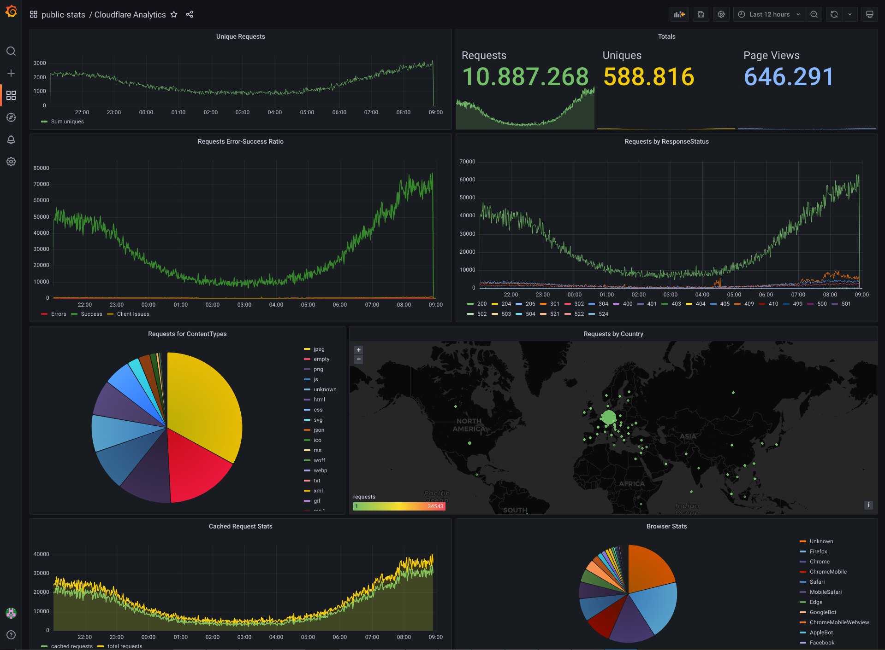

# Correct figures matter
There are several cloudflare-exporters out there, why another one? You might ask.
Well, because they all work the same - feeding a prometheus storage - and thus having all the same issue:
wrong figures!

## systemic issue
So, why is that?
Prometheus uses counters for most of the data. They only count up!
There is also no direct connection to the timestamp - it uses the timestamp of the scraping run.
All the cloudflare-exporters on the other hand, query the cloudflare-analytics GraphQL API in timeslices of 1 minute.
So, e.g. for the timeframe "2022-10-12T12:05:00"-"2022-10-12T12:06:00" it will return the amount of requests, pageViews etc.
How to put this information into prometheus? Well - not at all.

You can only provide an endpoint with metrics for prometheus to scrape. And you don't know when this will happen.
So all the cloudflare-exporters will take the values from the cf-api request and add them up to internal variables, which
then will be used to provide the metrics data.

Now we have two indirections and a lot of issues!

If the exporter-POD is restarted, for whatever reason, it starts counting from scratch.
Because the prometheus counters can only count up, it gets confused by the now lower value. Thus creating a new internal
metric/field with the same name.
This on the other hand will screw up the charts in grafana!

And if there is gap between stopping and starting the exporter-POD, that is larger than one or two minutes - this data will be lost!

But the charts usually don't match with the data in cloudflare-dashboard anyway. Because CF uses the absolute data,
whereas in grafana/prometheus there is only the data relative from the start of the exporter-POD.
So even if the graphs for a specific timeframe look identically, the numbers on those graphs might be off by orders of magnitude!
Try to explain to you SEO-folks, why the chart only shows like 800 average requests, when they expect more like 85000!

And then there are some other issues. E.g. due to the flat data-structure in prometheus, you'll have a hard time, combining some stats.
For example, if you'd like to have a chart for response-code stats, and don't want to show every individual code, but rather
combine all the 5xx, 4xx and the rest into three nice metrics (because your audience might not know the meaning of each code and
is only interested in errors, client issues and successful requests) - can't do that.

##  the solution
We must get the data in an absolute state, connecting the values to the respective timestamps.
And we already learned, that we can't do that with prometheus. So we need something else - like elasticsearch.

The cloudflare GraphQL API returns a nice formatted JSON, that we could put into elasticsearch right away ...if grafana had sufficient support for it.

### nothing lasts longer than a workaround...
The data in the JSON might be nicely structured, but for the charts it gets flattened nevertheless. And thus, constructs like mappings get lost!
This would affect the mappings for requests by response-code, as they're part of the document. We need them as separate documents in order to make it work.
...which wouldn't require that many changes, if grafana would support nested documents.

There is an open feature request: https://github.com/grafana/grafana/issues/4693
But the fact, that it has been ignored since 2016, doesn't make much hope for it to be solved any time soon.

So, back to steamroller tactics:
We need a separate document for every response-code, country, contenttype, browser-type, etc.
Instead of one well-structured document, we end up with up to several hundred small documents.

...well, they had it coming.

### concurrency
If you're running the exporter as part of a stack in a cluster, that might get deployed on multiple clusters and namespaces
...then concurrency is an issue. Because multiple exporters pushing into the same index, would screw up the data.

So the app has a feature to check, if it's allowed to run.
You can activate it in the config by setting `check_for_concurrency = True` \
It will then consider the property for `no_concurrency_uri`

The app will call this service and attach the parameters `cluster` and `namespace`, on which the service can decide if
that's the active environment, that is allowed to run the exporter.
The exporter itself will take the values for these parameters from the environment variables `LOCAL_CLUSTER` and `LOCAL_NAMESPACE`

The called services is expected to respond with either "True" or "False".

#### notes
* the app does not exit if it's not allowed to run, because in a cluster, the POD would end up in a restart-loop
* it checks, if it's allowed to run, right at the start, and re-checks every 5 minutes
* if it has been allowed to run, it re-checks, if that's still true, after every processing-iteration - and stops, if not
* WARN: there is no check for multiple PODs in the same namespace - you have to ensure, that the replica-count is set to 1 and that there is no HPA

#### Example
As the service must "only" compare two parameters, it can be as simple as an nginx with a config like this:
```
    server {
      listen 80;
      server_name _;
      root html;
      
      if ($arg_cluster != "my-active-cluster") {
        rewrite ^(.*)$ /invalid.txt break;
      }
      if ($arg_namespace != "my-active-namespace") {
        rewrite ^(.*)$ /invalid.txt break;
      }
      
      rewrite ^(.*)$ /valid.txt;
    }
```


# Requirements
* elasticsearch instance
* cloudflare account
* [Optional] "concurrency validation service"

# How to configure
## in the app
You must change some values in the `config.py`:
* `cf_api_user` - your cloudflare account
* `es_host` - Domain of your elasticsearch Instance/Cluster (must be reachable via https!)
* `es_user` - Elasticsearch user with permissions to read indices, create indices with the pattern specified in `es_cf_index_pattern`, create index-templates and ilm-policies 
* `zones` - configure the IDs and names of your cloudflare-zones

## at runtime
Secrets are injected via environment variables:
* `ES_PASSWD` - the password for your elasticsearch user
* `CF_API_TOKEN` - your cloudflare [API-token](https://developers.cloudflare.com/analytics/graphql-api/getting-started/authentication/api-token-auth/)

# Features
* stateless data provider (run where you want, restart how often you want)
* support automatic index rollover via ILM (you need to enable that feature in your elasticsearch instance)
* can close open gaps up to 7 days (if your index already contains documents and the exporter hasn't run for some time)
* fetches minute-accurate data from cloudflare analytics API
* support to prevent concurrency and thus ensure data-integrity

# Known Issues
* some metrics, that cloudflare provide, are not yet supported (e.g. firewall events, worker invocations, etc.)

# Screenshots

